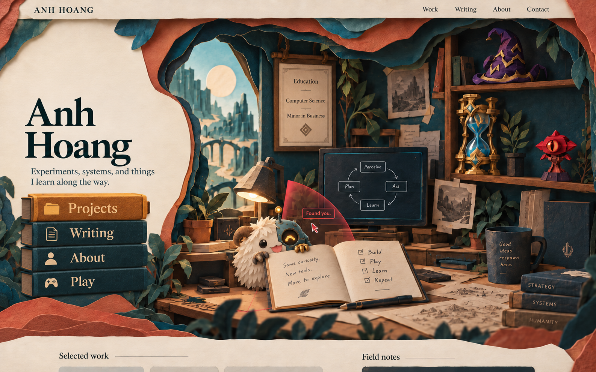

# Anh Hoang portfolio: the paper workshop

Product requirements and visual production specification, version 1.1

Status: detailed design specification for review. Requirements describe the intended website, not functionality already delivered.

Revision 1.1 incorporates Anh's direction that the navigation books should feel naturally stacked and integrated into the original workshop image. This replaces any interpretation that makes them prominent, uniform button-like blocks.

## 1. Purpose and source of truth

Build a personal portfolio that presents Anh as an AI-native builder interested in agents, systems, experimentation, and the mechanics and strategy of League of Legends. Visitors enter a handmade fantasy workshop, discover the work through objects, and continue into readable project stories and documentation. Anh must be able to publish a document or update personal information without editing a Blender scene.

The primary visual reference is the supplied image reproduced below. The image is the target for composition, atmosphere, material richness, and object detail. The previously created Blender scene and Three.js viewer are interaction prototypes; their simpler geometry and lighting do not redefine this target.



Source file: `exec-e57a9281-4ccc-45ae-ba93-8d8e5ab602e9.png`. A copy is retained with this document so the specification does not depend on a temporary attachment path.

Three evidence labels are used throughout:

- **Observed** means visible in the reference image. It does not prove a particular renderer, material node setup, font family, or interaction implementation.
- **Agreed** means requested in the conversation, including clickable objects, hourglass zoom, an education book with a map, and a decorative poro-inspired robotic agent.
- **Proposed** means a product or technical requirement introduced here to make the result usable and buildable. Numeric values are starting targets unless explicitly described as observations.

Priority definitions: P0 is required for the first public release; P1 is a follow-up enhancement; P2 is optional polish. P0 applies to visual fidelity as well as functional behavior.

## 2. Product outcome

The visitor should leave with a coherent story: Anh experiments, builds systems, learns through practice, and brings the curiosity and strategic thinking of a player into technical work. The objects should support that story through their function.

| Story element | Visible expression | Product purpose |
| --- | --- | --- |
| Identity | Oversized name on a quiet cream paper area | Establish who owns the work immediately |
| Building and agents | Monitor showing Perceive, Plan, Act, Learn | Introduce the process behind technical projects |
| Learning | Education certificate and open notebook | Connect formal education with ongoing exploration |
| Strategy and timing | Ornate hourglass and League collectibles | Add a personal, recognizable interest |
| Curiosity | Small creature peeking over the notebook | Make discovery playful and memorable |
| Evidence of practice | Drawings, notes, books, desk wear | Make the room feel used by a builder |
| Public record | Selected work and Field notes below the hero | Turn the visual introduction into useful portfolio content |

P0 success conditions:

1. A new visitor can identify Anh's name, area of work, and a way to view projects within five seconds in a small observed usability session.
2. Projects, writing, education, and contact remain available without discovering any 3D hotspot.
3. At least four of five test visitors can open a project and find contact information without assistance.
4. Anh can create a draft article, preview it, and publish it through the chosen authoring workflow without modifying scene assets or page layout code.
5. The full desktop composition is recognizable beside the reference at the same aspect ratio, including the dense right-hand workshop and quiet left-hand introduction.
6. A visitor can describe at least one connection between the objects and Anh's interests after browsing. Do not treat raw time on page as proof that the story works.

These are release targets, not measured results.

## 3. Audience and core journeys

| Audience | Primary need | Required path |
| --- | --- | --- |
| Recruiter or hiring manager | Understand focus, see credible work, make contact | Name and positioning, Selected work, project detail, Contact |
| Engineer or collaborator | Understand implementation, decisions, and lessons | Project detail, architecture or build notes, docs, repository/demo links |
| Curious peer | Explore personality and creative craft | Workshop, creature, League objects, Play, writing |
| Anh as author | Keep the site current with little friction | Content editor, preview, publish, verify |

The fastest journey must work through ordinary navigation. The exploratory journey can reveal extra depth. A visitor must never complete a puzzle, wait for an animation, or interact with the mascot to read the portfolio.

## 4. Scope and explicit boundaries

P0 includes the reference-faithful desktop workshop, functional book navigation, responsive content pages, project and writing publishing, profile editing, education map, hourglass focus, decorative companion, accessible alternatives, performance adaptation, and static fallback.

P1 includes richer collectible reactions, additional education milestones after content is supplied, optional audio after visitor activation, and deeper object-specific scenes.

P2 includes a full immersive room, collectible inventory, and seasonal room dressing. These must not consume the first release's fidelity or publishing budget.

There is no real Claude or other model-powered agent in this scope. The creature is a visual character. Its behavior uses local pointer, focus, and scene state. It does not identify visitors, access their camera, infer personal attributes, or imply it has read private information.

No school, graduation year, employer, project outcome, credential, social URL, or contact address may be invented. The confirmed educational wording is Computer Science and Minor in Business. League references express a personal interest; they do not imply a Riot affiliation. Asset provenance must be recorded during production.

## 5. Information architecture

The top strip uses the visible labels Work, Writing, About, and Contact. The left stack uses Projects, Writing, About, and Play. Work and Projects must lead to the same project collection. The difference preserves the reference while avoiding competing content destinations.

| Route, proposed | Content | Entry points |
| --- | --- | --- |
| `/` | Workshop, Selected work, Field notes, brief contact invitation | Logo or name |
| `/projects/` | Project collection with concise summaries | Work, Projects book, Selected work heading |
| `/projects/[slug]/` | Problem, contribution, approach, results, links | Project cards |
| `/writing/` | Essays, field notes, build logs | Writing nav, Writing book, Field notes |
| `/writing/[slug]/` | Readable article | Writing cards and related content |
| `/docs/` | Searchable technical documentation index | Writing page and project details |
| `/docs/[...slug]/` | Structured technical document | Docs index, sidebar, search |
| `/about/` | Bio, education, interests, current focus | About nav/book, education map link |
| `/play/` | League, mechanics, strategy, creative interests | Play book and optional collectible links |
| `/contact/` | Verified contact channels | Contact nav and page footer |

Separate docs and writing because reference material needs stable navigation and lookup while essays benefit from a reading sequence. They may share a content store and editor. Search can be a build-generated local index for P0; a hosted search service is not required by this PRD.

All content routes support direct loading and browser Back/Forward. Internal content transitions must not require the workshop to be loaded first.

## 6. Reference composition and spatial hierarchy

The image is approximately a 1.60:1 landscape composition. Positions below are visual estimates expressed as percentages of its full width and height, including the top navigation and the small visible section below the hero. They are composition guides, not pixel-perfect measurements.

| Region | Approximate bounds | Required visual role |
| --- | --- | --- |
| Top cream navigation strip | x 3–97%, y 0–5% | Thin, quiet, legible horizontal anchor |
| Cream identity clearing | x 0–32%, y 5–81% | Largest quiet shape; left text remains dominant |
| Name | x 4–24%, y 25–43% | Two lines with forceful serif letterforms |
| Intro sentence | x 5–28%, y 45–50% | Short supporting copy with two visible lines |
| Book navigation | x 3–25%, y 52–80% | Four physical books integrated into the room, with readable spine labels and subtly varied proportions |
| Landscape opening | x 28–44%, y 11–59% | Distant city, bridge, pale sun, and sky |
| Education certificate | x 45–57%, y 13–41% | Vertical parchment frame on the wall |
| Monitor | x 53–72%, y 39–62% | Dark process diagram behind the notebook |
| Companion | x 39–53%, y 58–79% | Cream organic silhouette with a mechanical half |
| Open notebook | x 44–73%, y 64–84% | Main foreground interactive object |
| Right collectible shelving | x 74–100%, y 6–52% | Tall, detailed, recognizable item silhouettes |
| Desk and nearby clutter | x 28–100%, y 61–90% | Foreground mass, warm light, working context |
| Lower cream content sheet | y 91–100% | Visual transition to Selected work and Field notes |

The layout is asymmetrical. Roughly one third of the width provides identity and navigation; the other two thirds contain the workshop. The desk and opening pull the eye into the room, while the dark wall prevents the cream name area from disappearing into the background.

P0 composition rules:

- Preserve the large cream void behind the name. Do not fill it with extra illustrations, badges, or small metadata.
- Preserve the irregular vertical paper boundary between the introduction and the room. It should curve around the name panel rather than create a straight split screen.
- Let the outer terracotta and teal paper layers overlap the room. Their thickness and shadows must read as foreground depth.
- Keep the notebook, creature, and monitor as distinct overlapping silhouettes. The notebook may hide the creature's lower body, but the face and paws remain readable.
- Keep the degree plaque above the monitor region and the three League-inspired items on the right shelf.
- Allow foreground leaves and paper edges to be clipped. Never clip essential text, navigation labels, or the notebook's primary interaction target.
- Ground the navigation stack among the scene's paper, foliage, and supporting surfaces. Preserve the original reference's sense that the books belong to the workshop. Do not isolate them as a perfectly aligned menu floating on the cream panel.
- Do not mirror the composition. The cream left side and detailed right side define this reference.

## 7. Art direction and detail density

The target is an illustrated physical diorama with believable materials. Large forms have a handmade construction language: cut edges, folded planes, wrapped covers, layered leaves, and built-up paper shapes. Fine detail adds fibers, stamped patterns, scuffs, page edges, and warm reflections.

It is not sufficient to model each object as a clean primitive and add a noisy texture. Each important object needs recognizable construction details that change its silhouette or explain how it was made.

Use three scales of detail:

| Scale | Examples | Requirement |
| --- | --- | --- |
| Large forms | Cream opening, shelf uprights, notebook spread, landscape silhouettes | Read when the image is reduced to a thumbnail |
| Medium construction | Rolled parchment ends, brass hourglass supports, folded hat brim, creature tufts, book ridges | Remain visible at ordinary desktop size |
| Surface detail | Paper fibers, shallow embossing, brass scratches, ink variation, wood/paper creases | Reward closer views without creating visual static |

The right side should feel densely occupied but arranged. At least six overlapping depth groups should be legible: foreground plants/paper, desk front, notebook/creature, monitor and tabletop props, shelves/wall, distant landscape. The final count can vary. Distinct separation is more important than a layer count alone.

Detail density is lowest around the name and reading areas, moderate on navigation and the degree plaque, and highest around the notebook, companion, hourglass, and desk. Do not apply equal noise, roughness variation, or edge wear to every material.

## 8. Palette and typography

The palette below is proposed by visual approximation. It is not a sampled color specification. Final colors must be checked under the actual lighting and tone mapping; material base color and rendered color will differ.

| Token | Starting color | Use |
| --- | --- | --- |
| Paper cream | `#EFE3CD` | Intro, header, section backgrounds |
| Paper highlight | `#FFF1D5` | Lit paper edges and lamp-lit pages |
| Ink teal | `#09282B` | Main type and deepest structural accents |
| Deep teal | `#143B40` | Wall, book covers, outer paper layers |
| Weathered blue | `#3D6A70` | Secondary folds and distance |
| Terracotta | `#B95339` | Outer cut paper, pots, warm framing |
| Rust shadow | `#713322` | Crease valleys and warm occlusion |
| Muted ochre | `#9B7744` | Aged Projects cover; tune under scene lighting so it does not dominate the stack |
| Aged brass | `#B68A45` | Hourglass, hardware, mechanical parts |
| Foliage | `#4A5841` | Olive leaf faces, with darker teal backs |
| Amethyst | `#4E235D` | Deathcap cloth/paper body |
| Ward red | `#C5282B` | Control Ward eye housing |
| Agent amber | `#FFB943` | Mechanical eye and antenna |

Typography is editorial and book-like. The exact reference font is unidentified. Select a licensed display serif with strong thick/thin contrast, broad capitals, and a distinctive lowercase g. Use a compatible readable serif for short navigation and book labels. Article body copy can use a restrained serif or sans serif, selected for long-form reading.

Proposed desktop values at roughly 1440–1600 CSS pixels wide:

- Name: 92–112px, two lines, line-height 0.88–0.98, near-black teal. The exact wrap is `Anh` then `Hoang`.
- Header wordmark: 23–28px, uppercase, moderate tracking.
- Top navigation: 17–20px, regular weight.
- Intro: 21–25px, line-height 1.2–1.35, maximum 30–34 characters per line.
- Book labels: 32–40px, cream, left aligned after the icon.
- Section titles: 25–34px.
- Long-form body: 17–20px, line-height 1.6–1.8, 60–75 characters per line.

Handwriting is restricted to notebook decoration, diagrams, and a few props. Essential instructions and long passages use standard live text. Avoid encoding readable portfolio content as a rendered texture or triangulated Blender font mesh.

## 9. Material and texture specification

All shader numbers in this section are proposed starting ranges for production tests. They are not recoverable facts about the source image. Validate their appearance in the browser as well as Blender.

| Material family | Visible treatment | Construction and shader requirements | Failure to reject |
| --- | --- | --- | --- |
| Cream writing paper | Fine fibers, warm unevenness, soft edges | Roughness about 0.80–0.95; fine normal detail; subtle broad color variation; small edge thickness | Dirty mottling that interferes with text |
| Cut terracotta paper | Crumpled and embossed surface with irregular layered contour | Model large folds and rim thickness; bake fine creases; vary local fold orientation | Flat red border or uniformly serrated edge |
| Teal cut layers | Heavy fibrous paper, folded highlights, dark cavities | Separate overlapping shells with visible gaps; restrained edge wear; roughness about 0.75–0.95 | A single extruded outline with painted shadows |
| Book cover | Matte wrapped covers, restrained embossing, softened corners, worn ridges | Shallow ornamental motifs, irregular wear, endcap seams; roughness about 0.75–0.95; subdued edges without bright metallic framing | Identical rectangular blocks, glossy covers, repeated gold rails, or labels that look pasted onto buttons |
| Page block | Many fine cream page lines with uneven edges | A few modeled leaves near silhouette, normal or texture lines elsewhere | One featureless white slab |
| Parchment certificate | Warmer than intro paper, lightly aged, printed border | Curled or rolled mounting details; restrained stains; readable center | Burnt fantasy scroll treatment overpowering credentials |
| Desk and shelving | Warm brown, worn, fibrous or wood-like construction | Visible board joins, cut ends, nicks, and grain along construction direction | Perfect plastic laminate or excessive shiny varnish |
| Brass hardware | Warm metal, bright edge catches, darker joints | Metallic region near 1; roughness about 0.30–0.55; small bevels and color variation | Chrome-like mirror finish or flat yellow paint |
| Hourglass glass | Blue translucent-looking vessel with luminous internal volume | Clear outer silhouette; distinguish glass, inner sand/light, and gold frame; transmission or a tuned stylized approximation | Solid blue cone that loses the hourglass's transparency cue |
| Hat | Deep purple folded body with gold bands | Model major creases and asymmetric curled tip; use rough paper/fabric-like surface | Smooth cone plus torus |
| Creature fur | Cream layered tufts with warm self-shadow | Overlapping clustered tufts, tapered tips, varied directions and sizes | Uniform radial spikes or a bare sphere |
| Robot shell | Teal painted panels with brass fasteners | Curved plates, rim thickness, seams, restrained paint wear | Single flat blue disc glued onto fur |
| Robot eye | Amber pixel/light pattern in dark housing | Emissive pattern within a recessed lens; controlled halo | Featureless overexposed white circle |
| Monitor | Dark textured panel with charcoal frame | Modest sheen, inset screen, support hardware; diagram remains legible | Modern glossy laptop look unrelated to the room |
| Leaves | Folded olive and teal paper with central veins | Faceted folds, curved/tapered outline, mixed leaf angles; mostly opaque geometry | Repeated identical triangles or transparent-plane halos |
| Pots and mug | Matte worn dark or terracotta surfaces | Wall thickness, rim, base, handle and slight irregularity; roughness about 0.7–0.9 | Hollow-looking single-sided shells |
| Ink, drawings, notes | Slight variation and handmade linework | Dedicated decals or UV texture regions; keep important copy as live UI | Illegible generated pseudo-text treated as actual content |

### 9.1 Texture frequency and mapping

Use broad low-contrast variation to suggest age and medium-scale creases to show construction. Fine fiber detail should be visible only when the object is large enough on screen. Grain that shimmers during camera movement is a defect.

Do not reuse one conspicuous crumple pattern across all hero objects. Shared texture families are acceptable, but UV rotation, scale, masks, and selected unique details must keep repetition unobtrusive.

Texel density should reflect viewing distance. The hourglass, notebook, creature face, and navigation spines need close-view allocation. Tiny background notes can share an atlas. Bake high-frequency detail from richer source models into browser-efficient assets.

Preserve correct texture color-space handling: color textures and linear data maps have different roles. Verify exported roughness, metalness, and normal orientation in the actual runtime. The GLB must not rely on unsupported Blender procedural nodes.

### 9.2 Edge treatment

Large hero edges need thickness and a catchlight. Use small bevels where they affect highlights. Add larger irregularity only where the reference supports it: paper boundaries, folded hat edges, worn book corners, torn notes, and rough desktop ends. Avoid beveling every prop into a soft toy.

### 9.3 Navigation books: natural integration

Agreed revision, P0. The original supplied image is the reference for how the book stack belongs to the workshop. The stack should first read as a small collection of used books, then reveal its navigation function through readable titles and interaction feedback. Keep Projects, Writing, About, and Play in the same order.

Construction requirements:

- Give each book a slightly different width, thickness, cover overhang, and amount of visible page block. Proposed variation is approximately 3–8% in width and 5–12% in thickness relative to the stack's average. These are starting ranges, not a requirement to create visible disorder.
- Offset books subtly left/right and front/back. A small rotation about the vertical axis can expose the page edge or cover depth. Keep the spines broadly horizontal, physically supported, and easy to read. Avoid alternating exaggerated tilts or books intersecting one another.
- Show that covers wrap around a page block. Include gently rounded spines, cover lips, end seams, page-edge lines, and a few uneven or slightly curled edges. Contact between books should produce believable narrow shadows.
- Keep decorative binding details low contrast. Replace repeated bright gold vertical bands and hard rectangular outlines with subtle cover ridges, worn stamping, or sparse shallow embossing.
- Retain simple folder, document, profile, and controller icons if they fit the spine naturally. They should resemble printed or stamped marks in the cover, with the same visual treatment as the labels. Do not put them in separate glossy badges.

Color and material requirements:

- Use subdued, weathered teal for the lower books and an aged, muted ochre for Projects. The top book may be warmer than the others, but it must not be the brightest or most saturated object in the hero.
- Match the books' paper grain, cover wear, color temperature, and shadow softness to the other books and handmade surfaces in the room. Avoid an independent UI-like lighting treatment, glow, or rim around the stack.
- Keep spine lettering readable with softly warm cream ink. Texture and wear can affect the cover around the lettering, but must not erase letters or reduce navigation contrast.
- Use local variation in wear and embossing so the books feel related without appearing duplicated. Do not add uniform noise to simulate age.

Placement requirements:

- Give the lowest book a believable resting surface or contact with the surrounding scene. Use a soft grounding shadow and a small amount of adjacent foliage or paper overlap at the outer/lower silhouette, consistent with the original image.
- Keep labels and interactive areas clear. Plants may frame the stack; they must not cover a title or prevent a click.
- Preserve the name and introduction as the main left-side hierarchy. The stack is an approachable route into the portfolio, not a second hero competing for attention.

Acceptance: in a resting screenshot without a cursor or focus ring, a reviewer should describe this area as a stack of books belonging to the room. Reject perfectly repeated dimensions, equal UI-style gutters, neon or bright gold selection fills, metallic button borders, detached shadows, and an isolated floating-menu appearance. At the same time, all four labels must remain easy to scan and activate.

## 10. Lighting, shadows, and atmosphere

Observed lighting combines a warm desk lamp, a bright cyan/cream landscape opening, amber character lights, and enough ambient illumination to read the dark shelves. The reference does not establish exact light count or physical color temperatures.

| Light contribution | Proposed setup | Visual acceptance |
| --- | --- | --- |
| Broad scene key | Large soft source from upper/front-left, warm neutral | Cream paper retains detail; top-facing folds are brighter than cavities |
| Landscape/window fill | Cool blue-green contribution from the left-rear opening | Distant city separates from warm desk and certificate |
| Desk practical | Warm source inside the visible lampshade, approximately 2600–3000 K as a starting point | Bright underside of shade and a local pool on pages, fur, and desk |
| Room fill | Low, broad neutral/cool environment contribution | Dark wall remains teal with visible texture |
| Emissive details | Small amber eye/antenna and restrained screen or glass accents | Glows remain localized and do not wash out neighboring shapes |

The lamp must look like a source of the light it casts. The page nearest it should receive plausible warm illumination. The shade should occlude some light and have a brighter interior than exterior.

P0 shadow requirements:

- Contact shadows anchor the notebook, paws, lamp base, mug, books, and shelf props.
- The outer paper layers cast progressively deeper shadows into the opening.
- Shelf recesses and the wall behind the monitor are darker than forward-facing objects.
- Softness changes with distance from the receiving surface. Avoid one identical hard-edged shadow treatment across the room.
- Ambient occlusion must support creases and contacts without black outlines around every object.
- Dynamic objects must not visibly detach from baked shadows during animation. Use a separate dynamic/contact solution or limit motion to a range where the mismatch is not perceptible.

Use a fixed exposure and color pipeline after look development. Test the cream paper, purple hat, red ward, and amber eye together before approval. Blacks should retain teal information. Gold must remain distinguishable from ochre paper.

Depth of field in the reference softens the closest bottom leaves and distant details. A browser implementation may approximate this with prepared layers or low-cost effects. Never blur navigation, article text, focus indicators, or an active object. Excessive bloom, vignette, chromatic aberration, and lens flare are outside the target style.

## 11. Object-by-object production inventory

| Asset | Required visible details | Interaction or content role | Priority |
| --- | --- | --- | --- |
| Outer paper opening | Several terracotta and teal layers, crumpled faces, nonuniform edges, thin warm edge catches | Frames the room and supports subtle depth movement | P0 |
| Cream intro sheet | Fine fibers, natural edge, broad uninterrupted text area | Name and positioning in live HTML | P0 |
| Top navigation paper | Thin cream strip, slightly irregular lower contour, soft shadow | Persistent ordinary navigation | P0 |
| Projects book | Muted aged-ochre cover, stamped folder icon, subtle embossing, visible page block; no bright metallic frame | Project collection; warmer cover retained from reference | P0 |
| Writing book | Worn teal cover, stamped document icon, visible cream page edges, slightly different dimensions and placement | Writing collection | P0 |
| About book | Related weathered teal cover, profile mark, softened corners, individual spine and cover wear | About page | P0 |
| Play book | Dark teal cover, controller mark, visible cover lip, believable bottom contact and grounding shadow | Interests and League page | P0 |
| Landscape opening | Pale disk sun, layered angular towers/cliffs, arched bridge, atmospheric depth | Environmental story; no invented personal location | P0 |
| Degree plaque | Wood/brown frame, parchment, rolled top mounts, inner ornamental border, small lower emblem | Education and map entry point | P0 |
| Monitor | Inset dark screen, thick frame, stand, restrained handmade diagram | Perceive → Act → Learn → Plan → Perceive loop, following visible arrows | P0 |
| Desk lamp | Angular worn shade, light interior, articulated support, grounded base | Warm practical light | P0 |
| Companion | Horn, cream tuft layers, dark organic eye, pink tongue, paws over notebook, teal half-shell, amber eye, rivets, antenna | Decorative agent awareness and peeking | P0 |
| Notebook | Open cream pages, center gutter, uneven page edges, worn brown cover, readable scribbles | Education journey map opens from this object | P0 |
| Pen | Dark body, brass details, placed along the book's near edge | Foreground scale and realism | P0 visual, no action required |
| Hourglass | Gold feet and caps, vertical supports, blue glass chambers, central neck, decorative diamonds, internal hourglass/sand silhouette | Camera zoom and brief stasis reaction | P0 |
| Deathcap | Irregular purple brim, tall bent point, large gold zigzag ornament, folded construction | Recognizable League reference | P0 visual, P1 reaction |
| Control Ward | Red angular housing, bright vertically slit eye, pedestal, gold/bronze inner rim | Recognizable League reference; subtle look behavior | P0 visual, P1 reaction |
| Shelf structure | Brown uprights, at least two clearly readable levels, thickness, uneven finish | Grounds collectible grouping | P0 |
| Hanging sketches | Grayscale fantasy drawings, layered paper corners, pins/tape where visible | Wall detail and creative process | P0 visual |
| Loose desk maps | Overlapping cream sheets with diagram/sketch linework, curling corners | Foreground complexity | P0 visual |
| Right mug | Dark teal rough surface, thick rim/handle, warm handwritten phrase | Small personal prop | P0 visual |
| Strategy book stack | Three small horizontal books with worn lettering and exposed edges | Strategy, Systems, Humanity motif | P0 visual |
| Background books | Narrow spines, mixed heights, leaning placements, low-contrast wear | Shelf depth | P0 visual |
| Plants | Trailing vines above and beside shelf, desk pot, bottom foreground foliage | Softens structure and reinforces paper layers | P0 |
| Small desk tools | A few stacked notebooks/cards and compact objects | Supporting clutter, kept low contrast | P1 exact reconstruction |

Do not invent interactions for every visible prop. The scene should have a small number of predictable targets. Decoration remains decoration unless it has a clear content or playful purpose.

## 12. Reference copy and content treatment

Preserve these visible strings unless Anh changes them:

| Location | Text |
| --- | --- |
| Header | ANH HOANG |
| Header links | Work / Writing / About / Contact |
| Hero name | Anh / Hoang |
| Intro | Experiments, systems, and things I learn along the way. |
| Book tabs | Projects / Writing / About / Play |
| Plaque | Education / Computer Science / Minor in Business |
| Monitor nodes | Perceive / Plan / Act / Learn |
| Left notebook page | Same curiosity. / New tools. / More to explore. |
| Right notebook checklist | Build / Play / Learn / Repeat |
| Mug | Good ideas respawn here. |
| Small book spines | STRATEGY / SYSTEMS / HUMANITY |
| Lower section titles | Selected work / Field notes |
| Character reaction | Found you. |

The exact small handwriting on background notes cannot be reliably transcribed. Treat it as decorative linework. Do not use it to invent project facts.

The intro is poetic but does not explicitly state the professional focus. Proposed P0 solution: keep the visible line and add a concise live-text description near Selected work or within the accessible hero introduction stating that Anh builds with AI and agents. Final wording should be authored by Anh.

The red cone and Found you bubble are visible in this image. They represent a transient character reaction, not a permanent screen overlay. Earlier feedback asked to remove unnecessary annotations. Production should therefore keep explanatory callouts out of the resting scene and use the reaction sparingly.

## 13. Camera model and scene staging

Observed perspective shows a mostly frontal room, some visible desktop top surface, and reduced distortion. Proposed implementation: a constrained perspective camera with a relatively long focal length, or an orthographic camera tuned against the image. Choose based on a side-by-side projection test. The image alone does not determine the lens.

The default camera is authored, not freely orbitable. Free orbit would expose backs of objects, break the composition, and make scene navigation harder. Exploration uses named camera states and small bounded pointer offsets.

Required states:

- `home`: complete name, books, character, notebook, certificate, and collectibles.
- `hourglass`: the entire hourglass with sufficient breathing room, preserving its base and cap.
- `education`: readable open spread and map with the creature allowed to peek from behind.
- `companion`: the complete face, horns, antenna, mechanical eye, and paws.

Each state requires desktop and narrow-screen framing. A crop of the desktop camera is not an adequate mobile design.

Proposed motion limits: a 0.6–1.0 second focus transition with smooth acceleration and deceleration; at most 1–2 degrees of home pointer tilt; foreground displacement within roughly 6–14 CSS pixels at desktop scale. Reduce these if navigation targets appear to slide under the pointer.

Camera moves must follow a tested path with no pass-through of paper layers, wall, lampshade, notebook, or shelf. Keep the selected object legible throughout. Repeated clicks should update or reverse the current transition rather than queue animations.

## 14. Interaction specification

### 14.1 Book navigation

P0. Each spine is one large interactive area. Use actual links with meaningful destinations. Provide a visible focus state for keyboard users and a programmatic selected/current state.

Resting books follow the natural construction and placement requirements in section 9.3. Hover may move the selected book slightly forward, starting with an apparent displacement of roughly 2–4 CSS pixels at desktop scale, accompanied by a small local shadow change. Do not recolor the whole spine, surround it with gold rails, or make the stack bounce. Use a 120–180ms response as a starting target. Keyboard focus remains clearly visible through an accessible outline or equivalent indicator; it need not imitate a physical material.

The warmer Projects cover is a fixed material choice, not a reusable bright selected-state fill. Once a content route is active, communicate the current item through a restrained bookmark or small ink marker together with the programmatic current state. Do not repaint other books ochre as selection changes. Hover must not overwrite route state. Exact marker placement must preserve the book's natural appearance and title legibility.

A click navigates immediately or after a short optional transition under 300ms. Modified click, open in new tab, copying a link, browser history, and screen-reader semantics must work normally. Scene raycasting can invoke the same action; it cannot be the only path.

### 14.2 Hourglass

P0. Click or keyboard activation focuses the hourglass. The camera zooms smoothly while the background becomes less visually active. A visible Back to workshop control appears before the transition completes.

The hourglass can briefly brighten internally and trigger a short stasis reaction on the companion or selected scene accents. Proposed duration is 1.5–2.5 seconds. Navigation, scrolling, and keyboard controls never freeze. The hourglass remains available after the effect ends.

The first focused view preserves the gold supports and blue glass geometry. A later view can connect timing, mechanics, and strategy to Play content. Do not invent a personal essay or link to absent content.

Pressing Escape or Back to workshop returns to home. Browser Back should close the focus state if focus is represented in URL/history. A direct content page return must not trap the user in the effect.

### 14.3 Education notebook and map

P0. The reference shows an already open notebook on the desk. The resting production scene should retain this open-book composition. The earlier prototype's closed resting book is not a visual requirement.

On activation, the camera moves toward the notebook. A page turns or a folded insert opens to reveal the educational map. The map is a paper construction with trails and distinct landmarks, not a flat unrelated modal.

The initial content includes Computer Science and Minor in Business. A school, dates, courses, achievements, and projects can become landmarks once supplied. Until then, use conceptual landmarks clearly labeled by subject. Do not invent geographical routes or chronology.

Proposed sequence: begin camera focus immediately; start the page/insert action around 150ms later; reveal map layers after the page clears them; complete within about 1.2–1.8 seconds. Page hinges, fold pivots, and map scale must preserve convincing paper attachment. The map must not float through the book or grow from an obvious tiny dot.

On the focused map, selecting a landmark reveals concise live-text details beside or below the book. Provide a link to the full About/Education content. Every landmark must be available as an ordinary list item on small screens and in the accessible representation.

Repeated activation while open does not restart the sequence. Return closes the insert cleanly and restores the reference notebook spread. Changing to another view midway cancels or blends the sequence without leaving half-visible geometry.

### 14.4 Decorative agent

P0. The creature should appear curious and slightly mischievous. It peeks over the notebook, tracks nearby pointer movement with bounded eye/head movement, and occasionally blinks or adjusts its paws.

Proposed state model:

| State | Trigger | Behavior | Exit |
| --- | --- | --- | --- |
| Rest | Scene ready | Gentle breathing; no persistent callout | Nearby pointer or explicit activation |
| Notice | Pointer enters character neighborhood | Eye/head turns toward pointer | Pointer leaves or short timeout |
| Found | Deliberate approach or click | Brief amber eye change; optional Found you bubble and faint red scan wedge | About 1–1.5 seconds |
| Inspect | Character activated | Companion camera with accessible description | Back/Escape or another target |
| Stasis | Hourglass activation | Temporary golden tint and paused character motion | Timer ends or motion preference changes |
| Reduced motion | Visitor preference | Static pose and immediate state changes | Preference changes |

The red wedge is local to the character, partially transparent, softly edged, and short-lived. It must not obscure notebook text, sweep the whole display, capture pointer events, or resemble a real camera permission/surveillance feature. Its exact shape and strength are an art-direction decision after prototype review.

Use a cooldown, proposed at least 20 seconds, before another unsolicited Found you reaction. Explicit clicks can receive a brief response. No random messages during article reading. No sound by default. Decorative motion stops when the scene is offscreen or the tab is hidden.

### 14.5 Other scene objects

The degree plaque can open the same education view as the notebook. The monitor can reveal a short description of the agent loop or link to an authored project. P1 collectible reactions can make the ward look toward the pointer and the hat tilt slightly.

Every interactive object needs a sufficient hit area and a discoverable hint on hover/focus. Hints should name the destination or action, such as Open education map. Avoid permanent floating labels beside the collectibles, which would conflict with the clean reference scene.

### 14.6 Shared state and failure handling

Keep camera state, selected object, content route, animation state, and motion preference separate. There can be only one active camera target. Returning home must restore exposure, materials, input state, and UI overlays.

If WebGL fails or an asset cannot load, preserve the poster image and all navigation/content links. If an animation fails, let the user open the equivalent content directly. A lost graphics context should present a retry control while retaining content access.

## 15. Content below the hero

Observed: only the top of the Selected work and Field notes sections is visible. Card contents, filters, footer, and full page structure are not established by the image. The following is proposed.

Use a broad cream sheet with an irregular upper edge that overlaps the diorama. Maintain generous padding and quiet texture. Two desktop columns may place Selected work at roughly 60% width and Field notes at 40%. On mobile, use a single reading order with work first.

Project cards need a title, one-sentence description, image, role or contribution, and link. The project page expands into problem, constraints, decisions, implementation, evidence/results, limitations, and relevant links. Empty metrics should be omitted rather than fabricated.

Field note cards need title, short excerpt, publication date, type, and optional reading time calculated from actual content. Avoid fake timestamps or placeholder article titles at launch.

Reading pages should retain the cream, teal, and restrained serif language while reducing decorative texture behind body copy. Provide headings, anchors, code blocks, copy-code controls, image captions, tables, lists, and related content. The 3D room does not need to render on article or docs routes.

Docs require an index, section navigation, search, last-updated information, deep links, and a clear relationship to the relevant project. Long code lines scroll inside their block instead of widening the page. On small screens, the docs sidebar becomes an explicit navigation control.

Contact should show only verified channels. A contact form is optional; links can satisfy P0. Do not add a nonfunctional form as decoration.

## 16. Publishing and author experience

P0 requirement: content and personal details are structured separately from scene assets. Changes to a bio, project, post, contact link, degree label, or navigation label must not require re-exporting the GLB.

The existing app uses static export. Proposed first release: structured Markdown/MDX documents and data records, with an editor workflow that provides draft preview and triggers a rebuild on publication. A CMS-backed editor can write to the same content model. The final editor/provider is an open choice; neither a specific vendor nor a new account is assumed by this PRD.

The default recommendation is an editor with a simple publishing interface, because easy updates were an original user goal. Direct repository editing can remain a fallback. If the chosen CMS needs server-side preview or runtime authentication, revisit the static-export deployment choice explicitly.

| Content type | Required fields | Optional fields |
| --- | --- | --- |
| Profile | Name, intro, professional focus, bio, verified contact links | Photo, resume, availability, current interests |
| Project | Stable slug, title, summary, body, draft/published status | Hero image, role, dates, stack, demo/repository, outcomes, related docs |
| Writing | Slug, title, excerpt, body, status | Publish date, tags, type, cover, related projects |
| Documentation | Path/slug, title, body, section, ordering, status | Version, related project, last-updated date, redirect aliases |
| Education | Subject/qualification label, description, ordering | School, dates, courses, achievements, links, map landmark |
| Scene hotspot | Stable object ID, accessible label, action, destination or view | Hint, associated content ID |

Author journey: create or edit a record, preview the actual page, validate required fields/links, publish, and confirm the live version. Failed publication preserves the draft and shows a useful error. Existing URLs remain stable; renaming a slug requires a redirect strategy compatible with hosting.

Images need alt text or an explicit decorative designation. Content preview must support code blocks, links, headings, and mobile layout. Drafts must be excluded from public builds, search indexes, feeds, and sitemaps.

Published content should be exportable in a common format. Store asset attribution with media records. If an external editor is adopted, only authorized authors can modify content, and credentials stay out of client code.

## 17. Responsive layout and accessibility

The desktop image defines the art direction, not every viewport arrangement.

| Width range, proposed | Layout behavior | Interaction behavior |
| --- | --- | --- |
| 1200px and wider | Full asymmetrical workshop with two-line name and left stack | All primary object views, bounded pointer movement |
| 768–1199px | Reduce peripheral clutter; retain identity, books, notebook, creature, and hourglass | Larger hotspots, fewer simultaneous motion effects |
| Below 768px | Live-text identity and stacked navigation first; deliberately reframed workshop vignette beneath or beside concise intro | Tap-first controls, no hover dependency, optional Explore in 3D entry |
| Very narrow or low-capability | Optimized static scene image and normal content structure | Equivalent links and education list |

Mobile may use an alternate authored camera or a prepared crop emphasizing the character and notebook. It must not shrink the entire desktop image until labels become unreadable. Touch targets are proposed at a minimum of 44×44 CSS pixels with space between adjacent controls.

P0 accessibility acceptance:

- All actions are reachable by keyboard with visible focus and a logical order.
- Navigation uses links; actions use buttons; headings reflect document structure.
- A skip link moves directly to main content or Selected work.
- Keyboard focus never disappears behind a canvas or full-screen overlay.
- A focused-object overlay, if modal, moves focus into it and returns focus to the originating control on close. Nonmodal views must not trap focus.
- Normal body text targets at least 4.5:1 contrast; large text and meaningful UI indicators target at least 3:1. These are design acceptance thresholds, not a claim of certified conformance.
- Browser zoom at 200% preserves content and controls without horizontal page overflow.
- Reduced-motion mode removes parallax, idle loops, camera travel, scan sweeps, and decorative bounce. State changes and content remain available.
- A pause control stops ambient motion. It is distinct from Back to workshop.
- The canvas has a concise description; individual decorative meshes are not exposed as hundreds of accessibility nodes.
- Live regions announce meaningful view changes once, not every animation frame.
- Screen-reader users can access the same projects, writing, education, and contact content through semantic HTML.

The ability to distinguish red, gold, and teal must never be the only way to understand selected state or availability.

## 18. Rendering architecture and source files

The inspected repository currently declares Next.js 15.5.0, React 19.1.0, Three.js with range `^0.179.1`, React Three Fiber with range `^9.3.0`, and Drei with range `^10.7.4`. These are local manifest facts, not claims about current releases or exact lockfile resolution. `next.config.ts` uses static export and trailing slashes.

Proposed architecture uses Blender for modeled assets, UVs, source materials, and authored animations; GLB for browser scene delivery; Three.js through the existing React integration for rendering; and HTML/CSS for accessible text, links, reading pages, and publishing-driven data.

Keep three content layers independent:

1. Visual scene assets: room, props, character, paper layers, camera markers, animation clips.
2. Interaction definitions: object IDs, target cameras, allowed transitions, content destinations.
3. Portfolio content: identity, projects, writing, docs, education, and contact.

Example proposed interaction contract:

```ts
type SceneView = 'home' | 'hourglass' | 'education' | 'companion';

type SceneAction =
  | { kind: 'focus'; view: SceneView }
  | { kind: 'navigate'; href: string };

type Hotspot = {
  objectId: string;
  label: string;
  action: SceneAction;
};

const educationHotspot: Hotspot = {
  objectId: 'EducationBook',
  label: 'Open education map',
  action: { kind: 'focus', view: 'education' },
};
```

This is a design contract example, not code already installed in the site. Use meaningful names, typed actions, and explicit state transitions. Do not spread route strings or animation timing constants across object-specific event handlers.

Proposed project organization:

```text
docs/
  portfolio-workshop-prd.md
  references/paper-workshop-reference.png
content/
  profile.json
  projects/
  writing/
  docs/
  education.json
public/
  scene/
    workshop-poster.webp
    workshop-mobile.webp
    workshop-base.glb
    workshop-detail.glb
src/
  app/                       Existing Next.js routes
  components/workshop/       Canvas, view controls, fallback, overlays
  components/content/        Article, project, docs, and navigation UI
  lib/content/               Parsing, validation, indexes
  lib/workshop/              State, hotspots, quality profiles
tests/
  content/
  workshop/
  e2e/
```

Actual file splits can change during implementation. The ownership separation is required. Editable Blender sources remain under `D:/BlenderWorkspace/projects/` and exports used by the site are copied through a documented asset build step.

## 19. Complexity and asset budgets

The image has high visual complexity. The difficult work is matching handcrafted surfaces and coherent lighting while keeping text editable and object interactions stable. The existence of a simple 3D prototype does not establish production readiness.

| Workstream | Relative complexity | Main source of effort |
| --- | --- | --- |
| Composition and camera matching | High | Overlapping foreground, room opening, text-safe regions |
| Hero prop modeling | High | Hourglass ornament, folded hat, page construction, sculpted tufts |
| Companion and animation | High | Organic/mechanical integration, expression, contact with notebook |
| Materials and lighting | High | Consistent paper scale, brass/glass response, warm/cool balance |
| Education map | High | Page and fold sequencing, readable content, close-camera geometry |
| Browser optimization | High | Texture residency, shading, shadows, draw calls, loading |
| Publishing and content pages | Medium to high | Editor choice, static build integration, docs structure |
| Navigation and route wiring | Medium | Accessible links plus scene state and history |
| Decorative micro-reactions | Medium | Restraint, motion preferences, interruption handling |

Proposed geometry allocation for the complete visible scene, before profiling:

| Asset group | Initial triangle allocation |
| --- | --- |
| Paper architecture, desk, shelf, landscape | 45,000–85,000 |
| Companion | 30,000–60,000 |
| Notebook and education insert | 15,000–35,000 |
| Hourglass, hat, ward | 25,000–45,000 |
| Plants and small props | 20,000–40,000 |
| Total planning envelope | Approximately 135,000–265,000 |

These allocations are negotiable working budgets, not a performance guarantee. Silhouette and visible quality determine where geometry is spent. Fonts and ordinary page text should not dominate triangle count. Use baked detail where geometry would not change the silhouette or animation.

Proposed performance acceptance targets:

| Metric | Target and measurement context |
| --- | --- |
| Initial usable content | Live name/navigation and poster available before 3D initialization |
| LCP / layout stability | Aim for LCP ≤2.5 seconds and CLS ≤0.1 in the agreed mobile test profile; verify measured results |
| Poster transfer | Desktop poster ideally ≤350 KB; mobile ≤180 KB, adjusted if visible artifacts harm quality |
| Initial 3D transfer | Target ≤6 MB compressed assets, loaded after content/poster; defer optional close-view detail |
| Total scene transfer | Target ≤10 MB for a full exploration session |
| Draw calls | Start with ≤150 desktop and ≤80 mobile, then adjust using profiling |
| Frame rate | Aim for 60 fps desktop; maintain at least 30 fps on the agreed representative mobile device during ordinary exploration |
| Pixel ratio | Cap around 1.5–2 desktop and 1–1.5 mobile; tune dynamically |
| Decoded scene texture memory | Initial budget ≤96 MiB desktop and ≤48 MiB mobile; include mipmaps and document estimation method |
| Active interaction response | Visible feedback begins within 100ms under the agreed test load |

A 2048×2048 uncompressed RGBA texture uses about 16 MiB before mipmaps. Transfer size alone therefore cannot establish GPU suitability. Use texture compression where supported and verify fallback behavior. Do not put every asset in a separate 4K texture.

Favor baked room lighting with a limited dynamic light/shadow contribution. Avoid real-time soft shadows from every prop, screen-space effects that dominate frame time, and physics for stationary objects. Pause rendering when the hero is offscreen unless a visible transition requires it.

Define high, medium, and static quality modes. A visitor can choose the static mode. Quality adaptation should reduce effects and resolution before sacrificing identity, readability, or navigation.

## 20. SEO, privacy, and operational behavior

P0 requires meaningful page titles/descriptions, canonical content URLs, share images, a sitemap containing only published pages, descriptive image text, and server-generated/static HTML for core portfolio content. Search engines must not need to interpret a canvas to understand the portfolio.

The creature's reactions run locally. Any later analytics proposal must list collected events separately from the character feature. Optional anonymous events could include project opens, document searches, and scene-view activations. Do not collect raw pointer trajectories to make the decorative character work.

Contact details and public asset URLs are content. Editor credentials, private drafts, and API tokens are not shipped to the browser. If a future real agent is introduced, it requires a separate PRD for purpose, model behavior, cost, data access, and failure handling.

## 21. Verification and visual acceptance

Review the visual target separately from functional correctness. A working zoom does not compensate for a flat scene; a polished render does not compensate for inaccessible navigation.

Capture screenshots at a reference-like 1600×1000 viewport, at 1440×900, at 1024×768, and at 390×844. These are proposed review sizes. Include at least one real touch device and one lower-capability graphics device before release.

### 21.1 Visual review rubric

Score each category from 0 to 3: 0 missing, 1 rough blockout, 2 close with visible gaps, 3 matches the intended quality. Require no P0 category below 2 and explicit approval of the overall composition before release.

| Category | Acceptance evidence |
| --- | --- |
| Composition | Cream left field, large name, correct object hierarchy, shelf and desk proportions match the reference |
| Paper construction | Visible layer thickness, irregular contours, fold shadows, varied surface scales |
| Lighting | Local lamp pool, cooler distance, readable dark wall, anchored contact shadows |
| Materials | Brass, glass, fur, paper, cover, foliage, and desk remain distinct |
| Complexity | Rich secondary detail without noise or repeated primitive geometry |
| Character | Fluffy silhouette, mechanical integration, visible paws/eye/antenna, coherent expression |
| Collectibles | Hourglass, Deathcap, and ward are recognizable by shape and color |
| Typography | Name and navigation are crisp, legible, and proportionally close to the image |
| Navigation book integration | Varied physical books, restrained aged colors, page/cover construction, narrow contact shadows, and believable grounding; no uniform button-stack appearance |
| Close views | No clipping, blurry hero textures, exposed unmodeled backs, or weak geometry |
| Below-fold continuity | Cream sheet transition and editorial content feel part of the same site |

Compare three views: normal color, grayscale for value hierarchy, and reduced-size thumbnail for silhouette. Use side-by-side reference review and aligned overlays for large composition boundaries. Pixel-difference scores alone are unsuitable because the target is an illustrative reference and the site is interactive.

### 21.2 Functional acceptance matrix

| ID | Requirement | Verification |
| --- | --- | --- |
| NAV-01 | Work and Projects open the same collection | Pointer, keyboard, direct URL, modified-click checks |
| NAV-02 | All content works without 3D | Disable graphics or block GLB load and complete key journeys |
| SCN-01 | Hourglass focuses and exits reliably | Activate, interrupt, activate again, Escape, Back, reduced motion |
| SCN-02 | Education map unfolds without intersections | Inspect beginning, middle, final pose, and reversed/cancelled sequence |
| SCN-03 | Character remains decorative | Verify no model API or visitor-identification request is required |
| SCN-04 | Hover/focus targets respect occlusion and UI layers | Attempt clicks through desk/wall and beneath HTML overlays |
| SCN-05 | Motion controls work | Pause, reduced-motion preference, offscreen, hidden tab |
| CNT-01 | Author can publish without scene edits | Create a test draft, preview, publish to staging, verify all indexes |
| CNT-02 | Drafts remain private | Inspect generated output, sitemap, search, feeds, and route behavior |
| CNT-03 | Edited profile appears everywhere | Change one source record and verify header/about/map text where applicable |
| DOC-01 | Docs are readable and navigable | Long code, tables, anchors, search, sidebar, narrow viewport |
| A11Y-01 | Keyboard-only journey is complete | Home to project to contact; education focus and return |
| A11Y-02 | Screen-reader reading order is coherent | Check headings, landmarks, links, scene description, announcements |
| PERF-01 | Agreed budgets are measured | Save device/browser/profile and trace alongside results |
| ERR-01 | Asset and graphics failures preserve content | Simulate failed requests and context loss |
| HIST-01 | History and direct links behave predictably | Reload a deep link; Back/Forward through page and scene views |

Use targeted tests for content validation and scene-state transitions, browser tests for routes and input, and visual review for materials and composition. Avoid unit tests that simply count meshes or assert the exact helper implementation.

## 22. Existing project commands and implementation boundaries

The following commands are verified against the current package scripts. Run them from `D:/InProgressProject/portfolio` when implementation begins:

```powershell
npm run dev
npm run build
npm run lint
```

There is currently no `test` script in the manifest. A test command must be added when a test runner is selected; this document does not claim tests already exist. Because the current app exports static output, `next start` is not the production preview path for `out/`. A local static preview can use the installed Python runtime:

```powershell
& 'D:/BlenderWorkspace/python/cpython-3.11.15-windows-x86_64-none/python.exe' -m http.server 8768 --bind 127.0.0.1 --directory 'D:/InProgressProject/portfolio/out'
```

Always preserve existing user edits, keep portfolio copy in the content layer, retain editable source assets, check GLB output in the browser, and record asset provenance.

Resolve before implementation: editor/provider choice, new externally hosted services, public deployment target, any paid asset acquisition, and actual personal content missing from this PRD. These are outstanding product choices, not reasons to stop writing the specification.

Never ship invented credentials, make draft content public, include secrets in assets/client code, or silently replace the existing portfolio with the prototype.

## 23. Production phases and reviewable deliverables

| Phase | Deliverable | Exit condition |
| --- | --- | --- |
| 1. Reference and composition | Camera-matched blockout with text-safe zones and object silhouettes | Main proportions and overlapping shapes approved beside the reference |
| 2. Hero asset look development | Finished notebook, companion, hourglass, sample paper layers, lighting test | Materials are distinct and close-view quality is credible |
| 3. Complete room | Shelf, landscape, plants, sketches, desk clutter, navigation covers | Visual rubric reaches acceptable composition and richness |
| 4. Browser fidelity | Exported scene with matching lighting, poster, and quality profiles | No major material/export differences; budgets measured |
| 5. Interaction | Book links, hourglass focus, map sequence, companion states | Keyboard/pointer/touch, interruption, history, reduced motion verified |
| 6. Content and authoring | Project/writing/docs pages and publishing workflow | Anh can complete the author journey without scene edits |
| 7. Release review | Responsive, accessibility, failure, performance, and visual evidence | P0 matrix passes and remaining limitations are documented |

Phases are review checkpoints rather than calendar estimates. A reliable schedule depends on whether detailed assets are handcrafted, commissioned, reused, or generated and then cleaned up. Do not promise reference fidelity based only on the time required for a scripted blockout.

Required final deliverables: editable `.blend` sources, optimized GLB assets, packed or documented textures, poster images, source-controlled website, structured content, author instructions, asset licenses/provenance, and recorded verification results.

## 24. Gap between the existing prototype and this target

The existing local scene at `D:/BlenderWorkspace/projects/paper-workshop/` is useful for verifying camera focus, a basic map reveal, and interaction naming. It is not the completed visual target.

To meet this image, production needs richer folded paper geometry, less repetitive surface noise, more detailed brass and glass construction, a more naturally layered creature silhouette, an articulated lamp, dense but intentional desk dressing, the distant bridge/city, higher-quality wall drawings, and a warmer, more localized lighting composition.

The resting notebook should be open as in the reference. The map reveal should build from that pose. Website labels should move to an editable content/UI layer where possible. The current prototype's section panels are placeholders for real content routes and a publishing system.

This gap is substantive art and product work. Reusing prototype behavior is reasonable; treating its simple props as finished reference-faithful assets is not.

## 25. Outstanding decisions

These decisions refine implementation; they do not prevent using this document as a visual production brief.

1. Preferred editing experience: a visual CMS editor, repository-based Markdown/MDX, or both.
2. Exact school name, dates, education milestones, and which details should appear on the map.
3. Final professional positioning sentence and verified contact/resume links.
4. Whether the Found you scan reaction is retained in its subtle transient form or reduced to eye movement alone.
5. Final fonts and texture/asset licensing choices.
6. Whether the League objects are original reinterpretations or approved sourced assets, and how attribution is presented.
7. Representative desktop/mobile devices and network profile for performance acceptance.
8. Which real projects and field notes are ready for the first release.
9. Whether mobile defaults to a static vignette with optional 3D or a reduced real-time scene.
10. Final hourglass destination content after the visual zoom, if any.

## 26. Definition of done

The website is complete when its default desktop view captures the supplied image's composition, paper construction, material distinctions, and warm workshop lighting; its meaningful objects lead to the agreed experiences; its content remains readable and accessible independently of 3D; and Anh can publish or update information through a documented authoring workflow.

Completion requires recorded visual and functional evidence, not only a successful build or an exported Blender file. Any P0 exception must be explicitly documented with its effect on the visitor or author experience.
